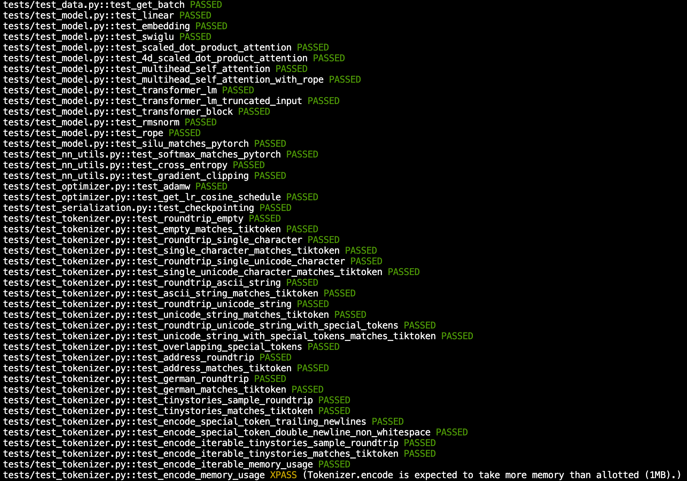
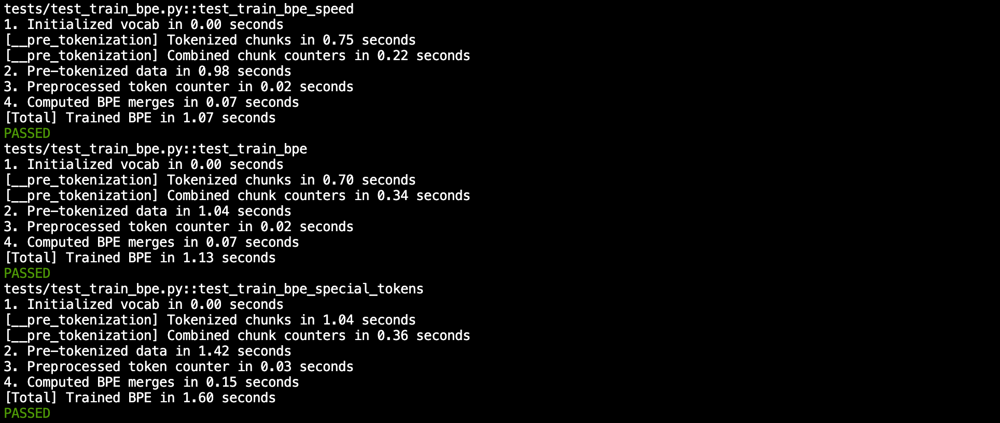
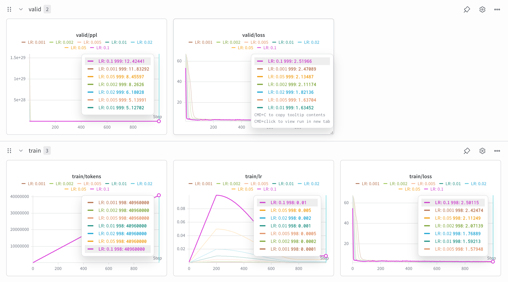
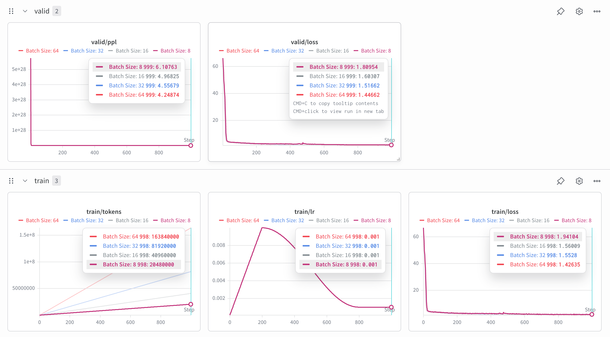
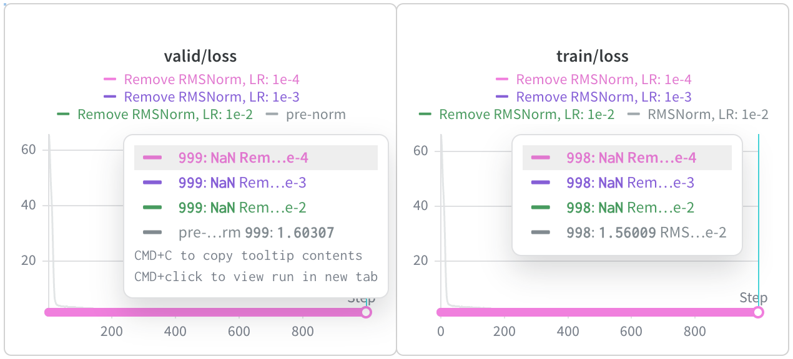
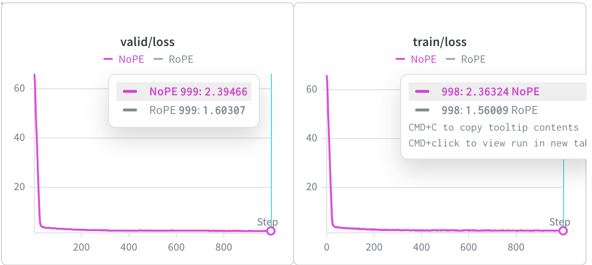
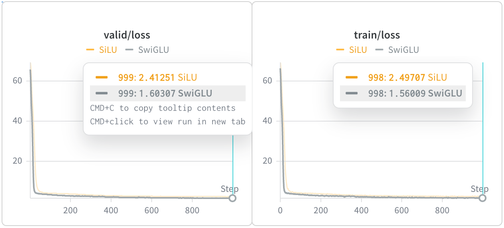

# LLM-from-Scratch

Build a Large Language Model from scratch, following the Stanford CS336 assignments.

## assignment1

**What you will implement**

1. Byte-pair encoding (BPE) tokenizer (§2)
2. Transformer language model (LM) (§3)
3. The cross-entropy loss function and the AdamW optimizer (§4)
4. The training loop, with support for serializing and loading model and optimizer state (§5)

**What you will run**
1. Train a BPE tokenizer on the TinyStories dataset.
2. Run your trained tokenizer on the dataset to convert it into a sequence of integer IDs.
3. Train a Transformer LM on the TinyStories dataset.
4. Generate samples and evaluate perplexity using the trained Transformer LM.
5. Train models on OpenWebText and submit your attained perplexities to a leaderboard.

### Directory structure

<details>
<summary><code>assignment1-basics</code> directory structure</summary>

- `cs336_basics/`: Original starter code and materials from the CS336 assignment.
- `data/`: Downloaded datasets (TinyStories, OpenWebText samples, etc.).
- `model/`: Tokenizer vocab/merges files and related model artifacts.
- `runs/`: Training checkpoints and run artifacts.
- `script/`: Utility and training scripts (e.g., tokenizer training, binarization, LM training).
- `src/`: Main source code for the tokenizer, Transformer model, and training utilities:
  - `config.py`: Dataclass-based configuration for data, model, optimizer, training loop, and WandB.
  - `tokenizer.py`: BPE tokenizer implementation, training, and batched encoding helpers.
  - `utils.py`: Shared utilities such as `Trie`, cross-entropy loss, batch sampling, and checkpoint save/load.
  - `dataloader.py`: Memory-mapped data loader that yields training batches via `get_batch`.
  - `attention.py`: Scaled dot-product attention, multi-head self-attention, and RoPE-based attention.
  - `rope.py`: Rotary positional embedding (RoPE) implementation.
  - `embedding.py`: Token embedding layer for mapping token IDs to vectors.
  - `linear.py`: Custom linear layer used across the model.
  - `softmax.py`: Numerically stable softmax implementation.
  - `rmsnorm.py`: RMSNorm normalization layer.
  - `swiglu.py`: SwiGLU feed-forward network and its wrapper `SwiGLUFFN`.
  - `transformer.py`: Transformer block and `TransformerLM` language model composed from the above modules.
  - `optimizer.py`: SGD, AdamW, learning-rate schedule, and gradient clipping utilities.
  - `generate.py`: Text generation entry points using a trained language model.
  - `tracker.py`: Simple experiment tracker integrating with Weights & Biases.
- `tests/`: Unit tests and the adapter layer connecting your implementations to the autograder.
- `wandb/`: Weights & Biases run logs (if logging is enabled).
- `pyproject.toml` / `uv.lock`: Project configuration and dependency lockfile managed by `uv`.
- `make_submission.sh`: Helper script for packaging and submitting your assignment.
</details>

### Setup

#### Environment

Prepare the environment with `uv` as described in [assignment1 README – Environment](assignment1-basics/README.md#environment).

#### Data

Download the pretraining datasets as described in [assignment1 README – Download Data](assignment1-basics/README.md#download-data).

### Quick Start

#### Unit tests

Run unit tests for the components which have implemented:

1. `cd assignment1-basics`
2. Run unit tests (they call functions in [assignment1-basics/tests/adapters.py](assignment1-basics/tests/adapters.py)):
   - Run all 48 tests: `uv run pytest`
   - Run a specific component test, e.g. `uv run pytest -k test_transformer_lm`

    <details>
    <summary>Unit test results</summary>

    
    

    </details>

#### Run
1. Train a BPE tokenizer on the TinyStories dataset.

    `uv run python script/train_bpe_tokenizer.py`

2. Run your trained tokenizer on the dataset to convert it into a sequence of integer IDs.

    `uv run python script/tokenize_and_bin.py`

3. Train a Transformer LM on the TinyStories dataset.

    - Use tokenized TinyStories dataset to train model, and evaluate perplexity

        `uv run python script/train.py`
    - Tune the learning rate: [1e-1, 5e-2, 2e-2, 1e-2, 5e-3, 2e-3, 1e-3]

        `uv run python script/learning_rate_experiment.py`
        <details>
        <summary>Learning rate experiment results</summary>

        
        optimal learning rate: 1e-2

        </details>
    - Batch size variations: [8, 16, 32, 64] (GPU memory limit)

        `uv run python script/batch_size_experiment.py`
        <details>
        <summary>Batch size experiment results</summary>

        
        optimal batch size: 64

        </details>

4. Generate samples and evaluate perplexity using the trained Transformer LM.

    - Generate and decode

        `uv run python script/generate_and_decode.py`
        <details>
        <summary>Generate and decode results</summary>

        **Input**
        ```text
        Once upon a time
        ```

        **Output**
        ```text
        Once upon a time, there was a small dog named Spot. Spot loved to play with his toy car. He would run around the park to play with. They all day, and the sun went on a tree. They liked to play with the toys with a ball.
        One day, Tom and Sam were playing with the ball together. They played together and had lots of fun. At the end of the day, Tim and his friends were very happy. They played together all day, laughing and having fun.
        <|endoftext|>
        ```

        </details>

5. Train models on OpenWebText and submit your attained perplexities to a leaderboard.

#### Other
1. Tuning the learning rate with SGD example

    `uv run python script/learning_rate_tuning_sgd.py`

### Ablations results
1. layer normalization
    <details>
    <summary><code>layer_norm_ablation</code>: Remove RMSNorm and train</summary>

    

    </details>
    <details>
    <summary><code>pre_norm_ablation</code>: Implement post-norm and train</summary>

    

    </details>
2. position embeddings
    <details>
    <summary><code>no_pos_emb</code>: Implement NoPE</summary>

    

    </details>
3. SwiGLU vs. SiLU
    <details>
    <summary><code>swiglu_ablation</code>: SwiGLU vs. SiLU</summary>

    

    </details>
